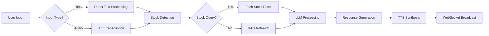

# 🏦 Shankh.ai Comprehensive Code & Data Flow Report

## 📊 **Project Overview**

**Shankh.ai** is a multilingual financial chatbot built with a modern microservices architecture, combining **Retrieval-Augmented Generation (RAG)**, **Speech-to-Text (STT)**, **Text-to-Speech (TTS)**, and **live stock market integration**. The system serves as an AI-powered financial assistant capable of answering queries from indexed PDF documents and providing real-time stock market data.

---

## 🏗️ **Architecture Overview**

```
┌─────────────────┐    ┌─────────────────┐    ┌─────────────────┐
│   FRONTEND      │    │    BACKEND      │    │   RAG SERVICE   │
│  (React + Vite) │◄──►│ (Node.js + LLM) │◄──►│ (Python FastAPI)│
│   Port: 5173    │    │   Port: 4000    │    │   Port: 8000    │
└─────────────────┘    └─────────────────┘    └─────────────────┘
         │                       │                       │
         │                       │                       │
    ┌─────────┐             ┌─────────┐             ┌─────────┐
    │ Browser │             │   LLM   │             │ FAISS   │
    │   UI    │             │Providers│             │Vector DB│
    └─────────┘             └─────────┘             └─────────┘
                                 │                       │
                          ┌─────────────────┐    ┌─────────────────┐
                          │  • Gemini 2.5   │    │ • 3,734 Chunks  │
                          │  • OpenAI GPT   │    │ • 887 Pages     │
                          │  • Claude       │    │ • Multilingual  │
                          │  • DeepSeek     │    │ • yfinance API  │
                          └─────────────────┘    └─────────────────┘
```

---

## 🔄 **Data Flow Architecture**

### **1. User Query Processing Pipeline**



---

## 🛠️ **Service Breakdown**

### **Frontend Service (React + Vite)**

- **Location**: `packages/frontend/`
- **Port**: 5173
- **Tech Stack**: React 18.2, Vite 5.0.8, Tailwind CSS, Socket.IO
- **Key Features**:
  - Real-time chat interface with WebSocket
  - Audio recording and playback
  - Message history with RAG citations
  - Responsive design with follow-up questions

### **Backend Service (Node.js + Express)**

- **Location**: `packages/backend/`
- **Port**: 4000
- **Tech Stack**: Node.js 18, Express 4.18, Socket.IO 4.6
- **Core Responsibilities**:
  - API orchestration and routing
  - LLM provider management with fallback logic
  - Stock query detection and integration
  - Session management and WebSocket handling
  - Audio processing (STT/TTS)

### **RAG Service (Python FastAPI)**

- **Location**: `packages/rag_service/`
- **Port**: 8000
- **Tech Stack**: FastAPI 0.109, FAISS 1.7.4, sentence-transformers 2.3.1
- **Core Responsibilities**:
  - Document ingestion and vector indexing
  - Semantic search and retrieval
  - Stock price fetching via yfinance
  - Whisper-based speech transcription

---

## 📚 **Document Knowledge Base**

### **Indexed Documents**

| Document   | Pages   | Chunks    | Content Type                   |
| ---------- | ------- | --------- | ------------------------------ |
| 149[1].pdf | 427     | 1,879     | Financial Services Guidelines  |
| 151.pdf    | 460     | 1,855     | Banking Policies & Procedures  |
| **Total**  | **887** | **3,734** | **Financial Domain Knowledge** |

### **Vector Database Configuration**

```python
# FAISS Configuration
Index Type: IndexFlatIP (Inner Product)
Embedding Model: paraphrase-multilingual-mpnet-base-v2
Vector Dimension: 768
Chunk Size: 700 characters
Overlap: 100 characters
Similarity Threshold: 0.5
Top-K Results: 5
```

---

## 🤖 **LLM Provider System**

### **Current Configuration**

```yaml
Primary Provider: Gemini 2.5-Flash
Fallback Provider: DeepSeek
Temperature: 0.7
Max Tokens: 2000
Response Format: Structured JSON
```

### **Supported Providers**

| Provider       | Model             | Status        | Use Case                      |
| -------------- | ----------------- | ------------- | ----------------------------- |
| **Gemini**     | gemini-2.5-flash  | 🟢 Active     | Primary reasoning & responses |
| **DeepSeek**   | deepseek-chat     | 🟡 Fallback   | Backup for high availability  |
| **OpenAI**     | gpt-4o            | 🔴 No Credits | Enterprise-grade responses    |
| **Claude**     | claude-3.5-sonnet | 🔴 No Credits | Advanced reasoning            |
| **OpenRouter** | Multiple models   | 🔴 No Credits | Model aggregation             |

### **LLM Response Structure**

```json
{
  "text": "Human-readable response",
  "language": "en|hi|auto-detected",
  "html_formatted": "<p>HTML version</p>",
  "rag_sources": [
    {
      "filename": "151.pdf",
      "page_range": "4-5",
      "excerpt": "Policy excerpt..."
    }
  ],
  "follow_up_questions": [
    "Related question 1?",
    "Related question 2?",
    "Related question 3?"
  ],
  "needs_verification": true|false
}
```

---

## 📈 **Stock Market Integration**

### **Stock Detection Logic**

The system automatically detects stock-related queries using:

**Keywords**: `stock price`, `share price`, `market price`, `current price`, `nse`, `bse`, `trading`

**Supported Stocks** (Major Indian NSE/BSE):

```javascript
RELIANCE.NS,
  TCS.NS,
  INFY.NS,
  HDFCBANK.NS,
  ICICIBANK.NS,
  SBIN.NS,
  WIPRO.NS,
  BHARTIARTL.NS,
  ITC.NS,
  HINDUNILVR.NS,
  MARUTI.NS,
  BAJFINANCE.NS,
  ASIANPAINT.NS,
  LTIM.NS,
  HCLTECH.NS,
  POWERGRID.NS,
  NTPC.NS,
  COALINDIA.NS,
  ONGC.NS,
  TATASTEEL.NS;
```

### **Stock Data Flow**

1. **Query Analysis**: Text parsed for stock keywords and symbols
2. **Symbol Mapping**: Company names mapped to NSE/BSE symbols
3. **yfinance API Call**: Real-time price data fetched
4. **LLM Integration**: Stock data contextualized in responses
5. **Cache Management**: 5-minute caching for performance

### **Stock Response Format**

```json
{
  "symbol": "RELIANCE.NS",
  "current_price": 2456.75,
  "change": 57.25,
  "change_percent": 2.39,
  "market_status": "OPEN",
  "last_updated": "2025-10-11T10:45:00Z"
}
```

---

## 🎯 **Request Processing Flow**

### **Text Query Processing**

```
1. [Frontend] → User types query → WebSocket emit
2. [Backend] → Receive via /chat/sendText endpoint
3. [Backend] → Stock detection analysis
4. [Backend] → RAG service call (/retrieve)
5. [RAG Service] → Vector similarity search
6. [RAG Service] → Return top-K documents
7. [Backend] → yfinance stock API call (if detected)
8. [Backend] → LLM call with RAG + Stock context
9. [LLM Provider] → Structured JSON response
10. [Backend] → TTS synthesis (optional)
11. [Backend] → WebSocket broadcast to frontend
12. [Frontend] → Display response with citations
```

### **Audio Query Processing**

```
1. [Frontend] → Record audio → Upload via /chat/sendAudio
2. [Backend] → Multer file handling
3. [Backend] → RAG service call (/transcribe)
4. [RAG Service] → Whisper model transcription
5. [Backend] → Process as text query (steps 3-12 above)
```

---

## 🗂️ **File Structure Overview**

```
Shankh.ai/
├── packages/
│   ├── frontend/                 # React + Vite UI
│   │   ├── src/
│   │   │   ├── App.jsx          # Main chat interface
│   │   │   ├── store/useStore.js # Zustand state management
│   │   │   └── utils/api.js     # API communication
│   │   ├── index.html
│   │   └── package.json
│   │
│   ├── backend/                  # Node.js API Server
│   │   ├── server.js            # Main Express server
│   │   ├── llmAdapter.js        # LLM provider orchestration
│   │   ├── sttService.js        # Speech-to-Text service
│   │   ├── ttsService.js        # Text-to-Speech service
│   │   ├── .env                 # Environment configuration
│   │   └── package.json
│   │
│   └── rag_service/             # Python FastAPI RAG
│       ├── server.py            # FastAPI endpoints
│       ├── ingest.py            # Document processing
│       ├── stock_service.py     # yfinance integration
│       ├── requirements.txt
│       └── tests/
│
├── data/
│   ├── pdfs/                    # Source documents
│   └── faiss_index/             # Vector database
│       ├── faiss_index.bin      # FAISS vectors
│       ├── metadata.pkl         # Document metadata
│       └── index_summary.json   # Index statistics
│
├── rag-demo/                    # RAG-only demo
│   ├── rag-demo.html           # Standalone demo
│   ├── server.py               # Demo HTTP server
│   └── README.md
│
├── docker-compose.yml           # Container orchestration
├── README.md                    # Project documentation
└── start-dev.ps1               # Development startup script
```

---

## 🔧 **Configuration Management**

### **Environment Variables (.env)**

```bash
# Core Configuration
NODE_ENV=development
PORT=4000
CORS_ORIGINS=http://localhost:5173,http://localhost:3000

# LLM Providers
LLM_PROVIDER=gemini                    # Primary provider
LLM_FALLBACK=deepseek                  # Fallback provider
GEMINI_API_KEY=AIzaSyC...              # Google API key
GEMINI_MODEL=gemini-2.5-flash          # Latest stable model

# Services
RAG_SERVICE_URL=http://127.0.0.1:8000  # RAG service endpoint
ENABLE_RAG=true                        # Enable document retrieval
ENABLE_TTS=true                        # Enable text-to-speech
ENABLE_STT=true                        # Enable speech-to-text

# Stock Integration
# (Handled automatically via yfinance)
```

### **RAG Configuration**

```python
# Document Processing
CHUNK_SIZE = 700          # Text chunk size
OVERLAP = 100            # Chunk overlap
TOP_K_DEFAULT = 5        # Max results returned
MIN_SIMILARITY = 0.5     # Relevance threshold

# Embedding Model
MODEL_NAME = "paraphrase-multilingual-mpnet-base-v2"
VECTOR_DIMENSION = 768
INDEX_TYPE = "IndexFlatIP"
```

---

## 📊 **Performance Metrics**

### **System Performance**

| Metric                  | Value      | Notes                 |
| ----------------------- | ---------- | --------------------- |
| **Vector Search Time**  | ~50-200ms  | FAISS IndexFlatIP     |
| **LLM Response Time**   | ~2-8s      | Depends on provider   |
| **Stock API Call**      | ~300-800ms | yfinance + 5min cache |
| **Audio Transcription** | ~1-3s      | Whisper base model    |
| **TTS Generation**      | ~500ms-2s  | gTTS service          |
| **Total Response Time** | ~3-10s     | End-to-end query      |

### **Knowledge Base Stats**

- **Documents**: 2 financial PDFs (887 pages)
- **Vector Index**: 3,734 chunks (768-dim embeddings)
- **Storage**: ~45MB FAISS index + metadata
- **Languages**: English + Hindi support
- **Update Frequency**: Static (re-ingest to update)

---

## 🎛️ **Key Features Implemented**

### ✅ **Core Functionality**

- [x] **Multilingual Support**: English & Hindi with language detection
- [x] **RAG Integration**: Semantic search through financial documents
- [x] **Real-time Stock Prices**: yfinance API with 20+ Indian stocks
- [x] **Voice Interface**: STT (Whisper) + TTS (gTTS) integration
- [x] **WebSocket Communication**: Real-time bidirectional messaging
- [x] **LLM Provider Fallback**: Automatic failover between providers
- [x] **Citation System**: Document sources with page references
- [x] **Follow-up Questions**: AI-generated conversation continuity

### ✅ **Technical Features**

- [x] **Microservices Architecture**: Separate frontend, backend, RAG services
- [x] **Docker Support**: Full containerization with docker-compose
- [x] **Session Management**: Conversation history and context retention
- [x] **Rate Limiting**: API protection against abuse
- [x] **Error Handling**: Graceful degradation and fallback mechanisms
- [x] **Structured Responses**: JSON-based LLM output parsing
- [x] **Audio File Management**: Automatic cleanup and storage

### ✅ **Stock Market Features**

- [x] **Intelligent Detection**: Keyword + symbol-based query analysis
- [x] **Real-time Pricing**: Live NSE/BSE stock data via yfinance
- [x] **Market Status**: Open/closed status with timestamps
- [x] **Performance Metrics**: Price changes and percentage calculations
- [x] **Caching System**: 5-minute cache to optimize API calls
- [x] **Error Resilience**: Graceful handling of API failures

---

## 🚀 **Deployment Guide**

### **Development Setup**

```bash
# 1. Start all services
./start-dev.ps1

# 2. Individual service startup
cd packages/rag_service && python server.py    # Port 8000
cd packages/backend && node server.js          # Port 4000
cd packages/frontend && npm run dev            # Port 5173

# 3. Access points
Frontend: http://localhost:5173
Backend API: http://localhost:4000
RAG Service: http://localhost:8000
RAG Demo: http://localhost:3001/rag-demo.html
```

### **Production Deployment**

```bash
# Docker Compose (Recommended)
docker-compose up -d

# Manual deployment
npm run build                    # Build frontend
node packages/backend/server.js # Start backend
python packages/rag_service/server.py # Start RAG service
```

---

## 🔍 **API Endpoints Reference**

### **Backend API (Port 4000)**

| Endpoint          | Method | Purpose                             |
| ----------------- | ------ | ----------------------------------- |
| `/health`         | GET    | Service health check                |
| `/status`         | GET    | System status & provider info       |
| `/chat/sendText`  | POST   | Text-based chat                     |
| `/chat/sendAudio` | POST   | Audio-based chat (with file upload) |

### **RAG Service API (Port 8000)**

| Endpoint          | Method | Purpose                       |
| ----------------- | ------ | ----------------------------- |
| `/health`         | GET    | Service health check          |
| `/retrieve`       | POST   | Document retrieval            |
| `/transcribe`     | POST   | Audio transcription           |
| `/stock/price`    | POST   | Single stock price            |
| `/stock/multiple` | POST   | Multiple stock prices         |
| `/stock/search`   | POST   | Stock symbol search           |
| `/stock/indices`  | GET    | Major indices (Nifty, Sensex) |

---

## 🎯 **Usage Examples**

### **Banking Query with RAG**

```
User: "What documents are required to open a savings account?"

Process:
1. RAG retrieval finds relevant PDF sections
2. LLM generates response with citations
3. Response: "According to the bank policy document [source: 151.pdf p23],
   you need: PAN card, Aadhaar card, address proof, and passport photos..."
```

### **Stock Price Query**

```
User: "What's the current price of Reliance stock?"

Process:
1. Stock detection identifies "Reliance" → RELIANCE.NS
2. yfinance API fetches live price data
3. LLM contextualizes: "Reliance Industries is currently trading at
   ₹2,456.75, up 2.34% today. The market is open."
```

### **Voice Interaction**

```
User: [Records audio] "Tell me about fixed deposit rates"

Process:
1. Audio uploaded to backend
2. Whisper transcribes to text
3. RAG retrieval + LLM processing
4. gTTS synthesizes response audio
5. Both text and audio returned to user
```

---

## 🐛 **Troubleshooting Guide**

### **Common Issues & Solutions**

**Issue**: LLM provider failures

```
Error: "Both primary (gemini) and fallback (deepseek) providers failed"
Solution: Check API keys in .env file, verify credits/quotas
```

**Issue**: RAG service connection failure

```
Error: "RAG retrieval failed: ECONNREFUSED"
Solution: Ensure RAG service is running on port 8000
         Check RAG_SERVICE_URL=http://127.0.0.1:8000 (not localhost)
```

**Issue**: Stock prices not working

```
Error: Stock queries not detected or prices not returned
Solution: Verify yfinance installation: pip install yfinance
         Check stock service logs for API errors
```

**Issue**: Audio features not working

```
Error: STT/TTS failures
Solution: Check Whisper model download, verify gTTS installation
         Ensure audio file permissions and temp directory access
```

---

## 📈 **Performance Optimization**

### **Implemented Optimizations**

1. **Vector Search**: FAISS IndexFlatIP for fast similarity search
2. **Stock Caching**: 5-minute cache reduces API calls
3. **Session Management**: In-memory conversation history
4. **Audio Cleanup**: Automatic old file removal
5. **WebSocket**: Real-time communication reduces HTTP overhead
6. **Structured Prompts**: Optimized LLM token usage
7. **Fallback Logic**: Multiple providers ensure high availability

### **Scaling Considerations**

- **Horizontal Scaling**: Each service can be containerized and scaled
- **Database**: Consider PostgreSQL/Redis for production session storage
- **Caching**: Implement Redis for stock data and frequent RAG queries
- **Load Balancing**: Nginx for frontend, multiple backend instances
- **Vector Database**: Upgrade to Pinecone/Weaviate for larger datasets

---

## 🎓 **Learning Resources**

### **Technologies Used**

- **Frontend**: React, Vite, Tailwind CSS, Socket.IO, Zustand
- **Backend**: Node.js, Express, Socket.IO, Multer, Axios
- **RAG**: Python, FastAPI, FAISS, sentence-transformers, Whisper
- **LLM**: Gemini API, OpenAI API, Anthropic Claude API
- **Stock**: yfinance, pandas, real-time market data
- **Audio**: gTTS, Whisper, HTML5 Audio API

### **Key Concepts**

- **RAG (Retrieval-Augmented Generation)**: Combines document retrieval with LLM generation
- **Vector Embeddings**: Text converted to numerical vectors for similarity search
- **WebSocket**: Bidirectional real-time communication protocol
- **Microservices**: Loosely coupled, independently deployable services
- **API Fallback**: Multiple provider support with automatic switching

---

## 🔮 **Future Enhancements**

### **Planned Features**

- [ ] **Multi-document Upload**: Dynamic PDF ingestion via UI
- [ ] **Advanced Analytics**: Query patterns and usage statistics
- [ ] **User Authentication**: JWT-based user sessions
- [ ] **Conversation Export**: PDF/CSV export of chat history
- [ ] **Advanced Stock Features**: Charts, alerts, portfolio tracking
- [ ] **Mobile App**: React Native mobile application
- [ ] **Language Expansion**: Support for more Indian languages
- [ ] **Enterprise Features**: Team collaboration, admin dashboard

### **Technical Improvements**

- [ ] **Production Database**: PostgreSQL for conversations & analytics
- [ ] **Advanced Caching**: Redis for better performance
- [ ] **Monitoring**: Prometheus + Grafana for system metrics
- [ ] **Security**: Rate limiting, input validation, API security
- [ ] **Testing**: Comprehensive unit & integration tests
- [ ] **CI/CD**: GitHub Actions deployment pipeline

---

## 📞 **Support & Maintenance**

### **System Monitoring**

- **Health Checks**: `/health` endpoints on all services
- **Logging**: Console logs with structured formatting
- **Error Tracking**: Detailed error messages and stack traces
- **Performance**: Response time tracking and optimization

### **Maintenance Tasks**

- **Vector Index**: Periodic re-indexing for document updates
- **Audio Cleanup**: Automatic temp file removal (configurable)
- **Log Rotation**: Implement log management for production
- **API Key Rotation**: Regular security credential updates
- **Dependency Updates**: Keep npm/pip packages current

---

**🎉 Congratulations!** You now have a comprehensive understanding of the Shankh.ai codebase, its architecture, data flow, and operational aspects. The system successfully combines modern RAG technology with real-time stock market data to create a powerful financial AI assistant.

**Happy coding!** 🚀
